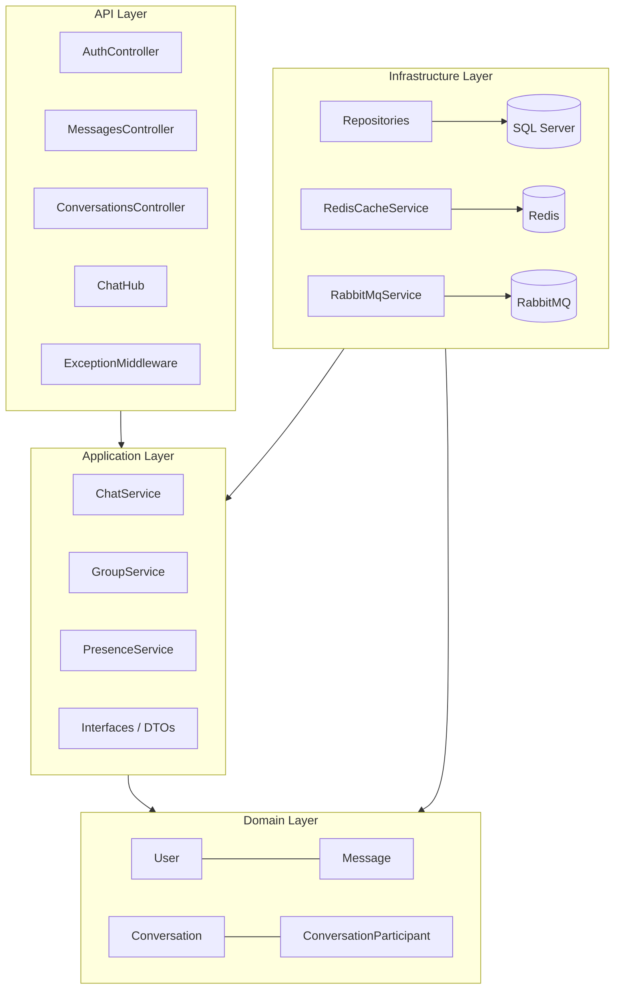
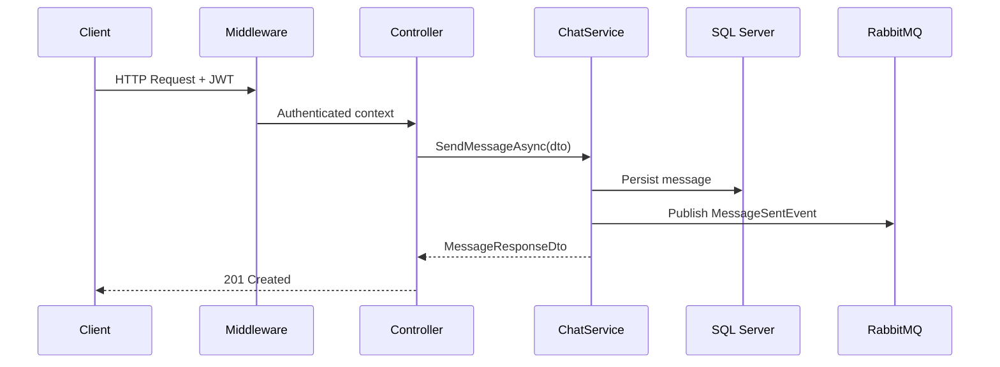

# RealtimeChatSystem

<p align="center">
  <strong>A production-grade real-time chat backend built with Clean Architecture.</strong><br/>
  Designed for horizontal scalability, correct message delivery guarantees, and clean domain boundaries.
</p>

<p align="center">
  
  
  
  
  
  
  
</p>

---

## Overview

Backend-only messaging platform implementing the core behaviour of systems like Slack and WhatsApp. The focus is on correctness under load: real-time delivery via SignalR WebSockets, SQL Server as the authoritative message store, Redis for presence tracking and multi-instance SignalR coordination, and RabbitMQ to decouple delivery from persistence.

This isn't a CRUD tutorial. The architecture addresses a concrete engineering problem — *how do you keep a chat system consistent across multiple server instances, with offline-user resilience and clean domain boundaries?*

---

## Features

| Category | Capability |
|---|---|
| **Auth** | JWT Bearer · BCrypt hashing · Refresh tokens · Claim-stamped sender identity |
| **Messaging** | 1-to-1 and group conversations · Real-time delivery · Soft-delete with body scrubbing |
| **Delivery Lifecycle** | `Sent → Delivered → Read` · Reconnect delivery sweep · Bulk read marking |
| **Presence** | TTL-based online/offline · Last-seen timestamps · Per-conversation indicators |
| **Real-Time** | Typing indicators · Presence heartbeat · SignalR group fan-out |
| **Scalability** | Redis SignalR backplane · Stateless JWT · Horizontal API scaling |
| **Reliability** | RabbitMQ durable queues · At-least-once event semantics · EF Core transient retry |
| **API** | REST + SignalR · URL versioning · Cursor pagination · Swagger/OpenAPI |
| **Architecture** | Clean Architecture · Rich domain model · Persistence ignorance · Global exception middleware |

---

## Architecture

Four concentric layers with a strict, unidirectional dependency rule.

```
┌──────────────────────────────────────────────────────────┐
│  API Layer          Controllers · ChatHub · Middleware    │
│                     JWT wiring · Swagger · Program.cs     │
├──────────────────────────────────────────────────────────┤
│  Application Layer  ChatService · GroupService            │
│                     PresenceService · DTOs · Validators   │
├──────────────────────────────────────────────────────────┤
│  Domain Layer       User · Conversation · Message         │
│  (zero deps)        ConversationParticipant · Enums       │
├──────────────────────────────────────────────────────────┤
│  Infrastructure     EF Core · Redis · RabbitMQ            │
│  (implements ↑)     Repositories · Caching · Messaging    │
└──────────────────────────────────────────────────────────┘
```



**Domain** — No external dependencies. Business rules and invariants live here exclusively, enforced through factory methods and private setters. Entities own their own state transitions (`Message.MarkAsDelivered()`, `Conversation.UpdateLastMessageAt()`).

**Application** — Orchestrates use cases, owns the repository and service interfaces. Returns DTOs, never domain entities. No business logic, no EF Core.

**Infrastructure** — Implements Application interfaces. EF Core, Redis, and RabbitMQ are fully encapsulated here — nothing leaks up.

**API** — Thin. Controllers extract identity from JWT claims, pass DTOs to Application services, return HTTP responses. That's it.

---

## Request Flow



**Real-time path (SignalR):** client calls `SendMessage` on the hub → `ChatService` persists to SQL Server → publishes to RabbitMQ → hub broadcasts to the SignalR group. The DB write always comes before the broadcast — no ghost messages.

---

## Engineering Decisions

**Clean Architecture** — The Domain has zero dependencies and is independently unit-testable. Infrastructure components (SQL Server, Redis, RabbitMQ) can be swapped by replacing implementations without touching the Application or Domain layers.

**Cursor pagination over OFFSET** — `WHERE SentAt < @cursor` is O(log N) at any history depth via the composite index. OFFSET scans scale linearly — at 50,000 messages, page 1,000 discards 49,950 rows on every request.

**TTL-based presence** — Redis keys with a 45-second TTL, refreshed by client heartbeats every 30 seconds. Key expiry handles network drops without a cleanup job. 10,000 concurrent users generate ~333 presence writes/second — the wrong workload for SQL Server.

**RabbitMQ for fan-out** — After a message is persisted, it needs to reach the real-time broadcast, push notification service, and any future consumer. Synchronous calls from `ChatService` would couple all of them to the write path. The queue decouples them; each consumer fails and retries independently.

**Redis SignalR backplane** — Without it, a message sent to a client on Server A can't reach Server B's clients. The backplane uses Redis pub/sub to synchronise group broadcasts across all instances — horizontal scaling requires no load balancer configuration.

**Middleware exception handling** — Action filters only cover controller execution. Exceptions from SignalR hubs or other middleware bypass them. The outermost middleware position wraps the entire pipeline: one error mapping, one response shape, no gaps.

**Sender identity from JWT** — `SenderId` is always stamped from the verified JWT claim, never trusted from the request body. One line prevents message impersonation across the entire system.

> Full architectural detail in [`/docs/architecture.md`](./docs/architecture.md)

---

## Getting Started

**Prerequisites:** .NET 8 SDK, Docker Desktop

```bash
# Start infrastructure
docker compose up sqlserver redis rabbitmq -d

# Apply migrations
dotnet ef database update \
  --project src/ChatSystem.Infrastructure \
  --startup-project src/ChatSystem.API

# Run the API
dotnet run --project src/ChatSystem.API
```

| Endpoint | URL |
|---|---|
| API Base | `https://localhost:7001/api/v1` |
| Swagger UI | `https://localhost:7001/` |
| SignalR Hub | `wss://localhost:7001/hubs/chat` |
| Health Check | `https://localhost:7001/health` |

---

## API Reference

### REST Endpoints

| Method | Route | Description |
|---|---|---|
| `POST` | `/auth/register` | Register — returns JWT pair |
| `POST` | `/auth/login` | Authenticate — returns JWT pair |
| `GET` | `/conversations` | Inbox, sorted by recent activity |
| `POST` | `/conversations/direct` | Start a 1-to-1 conversation |
| `POST` | `/conversations/group` | Create a group conversation |
| `POST` | `/conversations/participants` | Add participant (admin only) |
| `DELETE` | `/conversations/{id}/participants/{uid}` | Remove participant or leave |
| `PATCH` | `/conversations/{id}/rename` | Rename group (admin only) |
| `POST` | `/messages` | Send a message |
| `GET` | `/messages/conversations/{id}` | Paginated history (cursor-based) |
| `DELETE` | `/messages/{id}` | Soft-delete (sender only) |
| `PATCH` | `/messages/conversations/{id}/read` | Mark conversation as read |

### SignalR Hub (`/hubs/chat`)

Connect with `?access_token={jwt}`.

| Direction | Method | Purpose |
|---|---|---|
| Client → Server | `SendMessage(dto)` | Persist and broadcast a message |
| Client → Server | `JoinConversation(id)` | Subscribe to conversation group |
| Client → Server | `LeaveConversation(id)` | Unsubscribe from group |
| Client → Server | `NotifyTyping(id)` | Fan-out typing indicator (not persisted) |
| Client → Server | `Heartbeat()` | Refresh Redis presence TTL |
| Server → Client | `ReceiveMessage` | Inbound message payload |
| Server → Client | `MessageStatusUpdated` | Delivery / read status tick |
| Server → Client | `UserOnline / UserOffline` | Presence change |
| Server → Client | `UserTyping / UserStoppedTyping` | Typing relay |

---

## Project Structure

```
src/
├── ChatSystem.Domain/
│   ├── Entities/       User · Conversation · Message · ConversationParticipant
│   ├── Enums/          MessageStatus · ConversationType
│   └── Exceptions/     DomainException
│
├── ChatSystem.Application/
│   ├── Services/       ChatService · GroupService · PresenceService
│   ├── Interfaces/     IMessageRepo · IUserRepo · IConvRepo · ICacheService · IQueueService
│   ├── DTOs/           ChatDtos.cs
│   └── Validators/     SendMessageValidator · CreateGroupConversationValidator
│
├── ChatSystem.Infrastructure/
│   ├── Persistence/    AppDbContext · Configurations · Repositories
│   ├── Caching/        RedisCacheService
│   ├── Messaging/      RabbitMqMessageQueueService · MessageEvents
│   └── DependencyInjection/  InfrastructureServiceExtensions
│
└── ChatSystem.API/
    ├── Controllers/    AuthController · MessagesController · ConversationsController
    ├── Hubs/           ChatHub
    ├── Middleware/     ExceptionHandlingMiddleware
    ├── Extensions/     Auth · Swagger · ApplicationServices
    ├── Settings/       JwtSettings
    └── Program.cs
```

---

## 👤 Author
**Maamoun Ibrahim** Backend Developer | .NET  
[https://github.com/Maamoun1]
